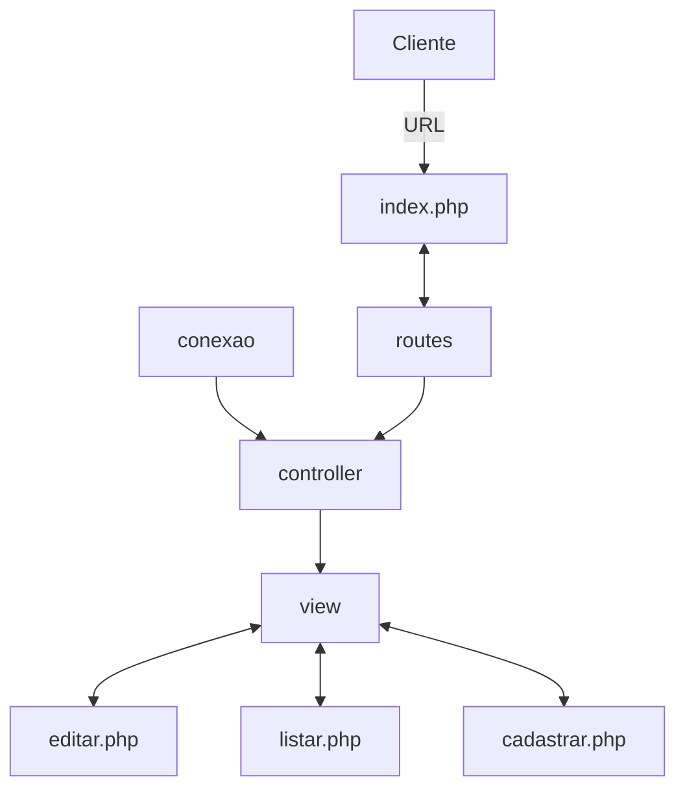
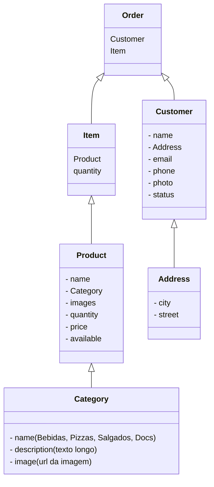

<<<<<<< HEAD
# Gerenciamento do Sistema de Merendas



## Estrutura inicial das classes/tabelas




## Como Contribuir

- Passo 1: Faca o clone do repositorio
```bash
git clone git@github.com:digitalcollege-classes/php-merenda.git
```


- passo 2: Voltar pro seu branch principal
```bash
git checkout main
```

- passo 3: Atualizar seu branch principal
```bash
git pull origin main
```

- passo 4: Criar um novo ramo/branch
```bash
git checkout -b nome-da-branch
```

- passo 5: Faz o que tem que fazer

- passo 6: Commitar as mudancas feitas


=======
## Estrutura inicial das classes

```mermaid

```
>>>>>>> ac5ba28bd415a92c206fe173498f4b99dc5af8bb
