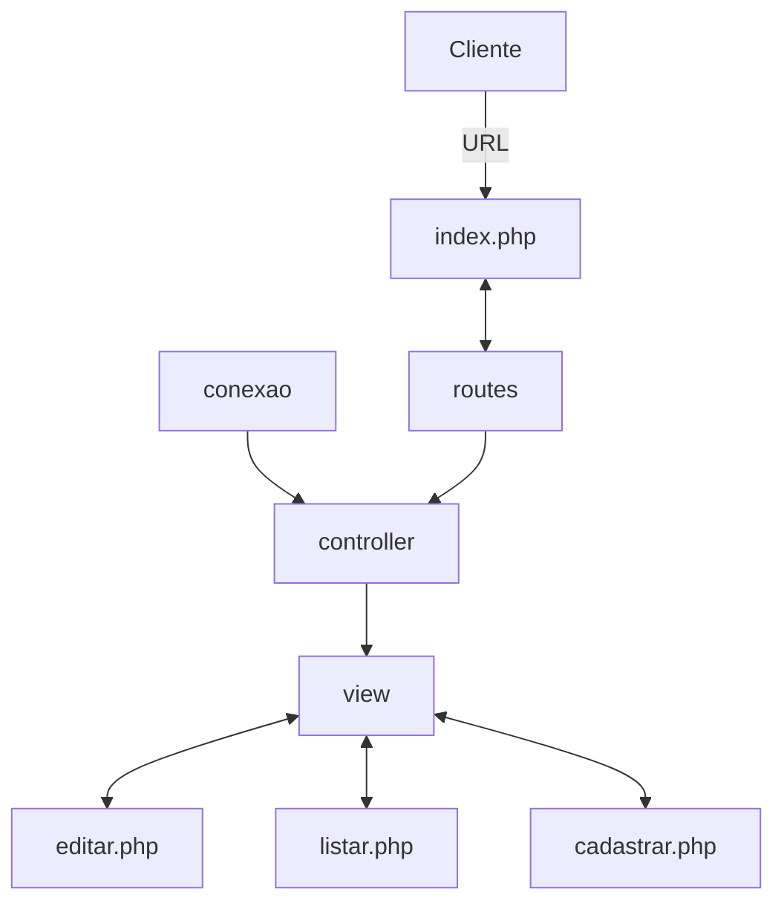
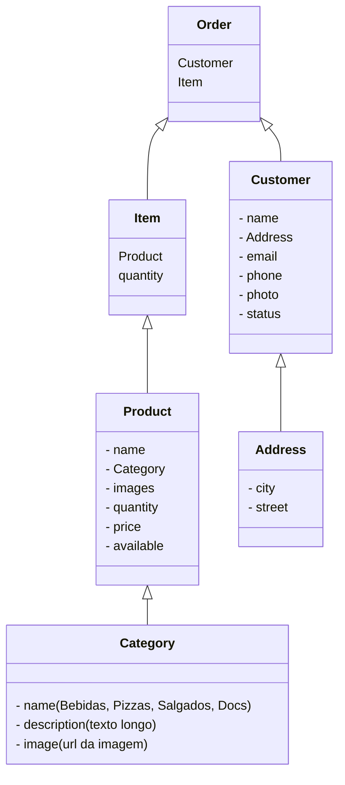

# Gerenciamento de Merendas

```mermaid
flowchart TD
    Cliente --URL--> index.php
    index.php <--> r[routes]
    view <--> editar.php
    view <--> listar.php
    view <--> cadastrar.php
    c[conexao] --> controller
    r --> controller
    controller --> view
```

## Estrutura inicial das classes/tabelas

```mermaid
classDiagram
    Category 
    Product <|-- Category
    Customer <|-- Address
    Address 
    Order <|-- Item
    Order <|-- Customer
    Item <|-- Product

    class Order {
        Customer
        Item
    }

    class Item {
        Product
        quantity
    }

    class Category {
        - name (Bebidas, Pizzas, Salgados, Docs)
        - description (texto longo)
        - image (url da imagem)
    }

    class Product {
        - name
        - Category
        - images
        - quantity
        - price
        - available
    }

    class Customer {
        - name
        - Address
        - email
        - phone
        - photo
        - status
    }
    
    class Address {
        - city
        - street
    }
```